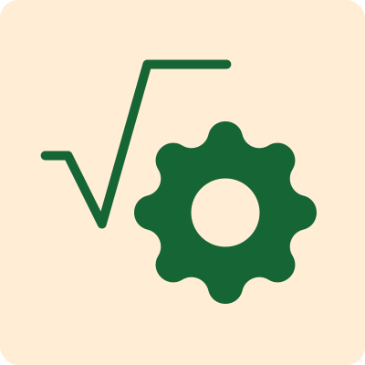

<p align="center">
  
  <h3 align="center">LearnAI</h3>
</p>

<p align="center">Spend more time learning, less time searching</p>

<br/>

## 📖 Overview

LearnAI is an AI-powered chatbot designed to help users study mathematics in a personalized manner. Utilizing advanced technologies including Next.js, Flask, MongoDB, and the ChatGPT API, this chatbot provides a unique and interactive way to practice and master mathematical concepts.

## ⭐ Features

- **Personalized Study Sessions**: Users can specify the math subjects they want to focus on.
- **Interactive Q&A**: The AI poses practice questions and provides instant feedback on answers.
- **Adaptive Learning**: The chatbot adjusts the difficulty of questions based on user performance.
- **Instant Corrections and Explanations**: Provides corrections and detailed explanations for better understanding.

## ⚒️ Tech Stack

- **Frontend**: Next.js
- **Backend**: Flask
- **Database**: MongoDB
- **AI Integration**: ChatGPT API

## 💨 Workflow

1. **User Input**: The user inputs the subjects they need to study.
2. **Question Generation**: The AI generates relevant questions for the user to practice.
3. **User Response**: The user answers the questions.
4. **Feedback and Adaptation**: The AI provides corrections and explanations, and proposes new questions based on the user's performance.

## ❓ Usage

Explain how to use the application. Include any necessary commands, URLs to access the app, etc.

## 📦 Installation

Install all dependencies
```
bun install
```

Run the project
```
bun run dev
```

Open [http://localhost:3000](http://localhost:3000) with your browser to see the result.

The Flask server will be running on [http://127.0.0.1:5328](http://127.0.0.1:5328) – feel free to change the port in `package.json` (you'll also need to update it in `next.config.js`).
